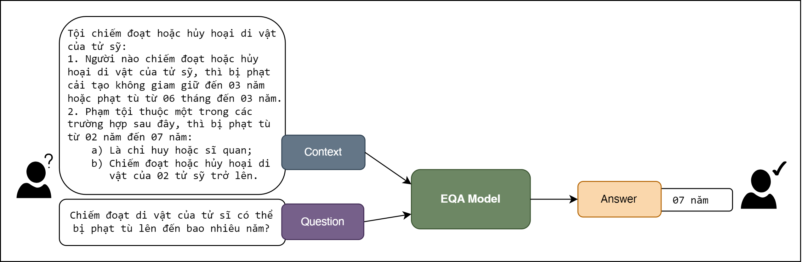

# ViLQA: Vietnamese Legal Question Answering

## Introduction

**ViLQA** is a project focused on fine-tuning Question Answering models for Vietnamese legal text. This project aims to enhance the performance of models in answering questions based on Vietnamese legal documents, particularly on extractive question answering datasets.

## Project Structure

This project implements two approaches to Extractive Question Answering:

1. **MRC (Machine Reading Comprehension)**: This approach extracts the answer (span text) directly from the given context.
2. **AG (Answer Generation)**: This approach generates the answer based on the context and question.

The code for each approach is organized in separate directories (`MRC/` and `AG/`) for clarity and maintainability.

## What is Extractive Question Answering?

Extractive Question Answering (EQA) is a Natural Language Processing task where the model is given a question and a context (usually a paragraph or a document) and needs to extract the answer to the question directly from the context. The key assumption in EQA is that the answer is a continuous span of text within the given context.

Here's an example of Extractive Question Answering:

<figure>
  <p align="center">
    
  </p>
  <p align="center"><normal>Fig.1: An example of Extractive Question Answering</strong></p>
</figure>


In this example:
- Context: The legal text about the crime of appropriating or destroying relics of fallen soldiers
- Question: "Chiếm đoạt di vật của tử sĩ có thể bị phạt tù lên đến bao nhiêu năm?" (How many years of imprisonment can one face for appropriating relics of fallen soldiers?)
- Answer: "07 năm" (07 years)

The model must extract the correct answer span from the given context based on the question.

```plaintext
ViEQA/
│
├── MRC/
|   ├── config.py                 # Project configuration file
|   ├── train.py                  # Main script for fine-tuning
|   ├── requirements.txt          # List of required Python libraries
|   ├── data/
|   │   ├── __init__.py           # Init module for data
|   │   ├── data_processing.py    # Data processing script
|   │   └── dataset/
|   │       └── ALQAC.csv         # Vietnamese dataset for QA
|   ├── models/
|   │   ├── __init__.py           # Init module for models
|   │   └── eqa_model.py          # Model for Extractive Question Answering
|   └── utils/
|       ├── __init__.py           # Init module for utils
|       └── metrics.py            # Script for calculating model metrics
└── AG/
    ├── data/
    │   └── ALQAC.csv             # Vietnamese dataset for QA
    ├── data_processor.py         # Handles data preprocessing and formatting
    ├── config.py                 # Contains configuration settings for the model and training process
    ├── utils.py                  # Utility functions for text processing and evaluation metrics
    ├── model.py                  # Defines the model architecture and loading functions
    ├── train.py                  # Implements the training loop and related functions
    ├── evaluate.py               # Contains functions for model evaluation and prediction generation
    └── config.py                 # The main script to run the entire pipeline
```

### Key Features

- Fine-tuning Question Answering models on Vietnamese data.
- Support for advanced language models.
- Easy integration with popular tools and libraries.
- Customizable and extendable for different datasets.

## System Requirements

- Python 3.7 or higher
- Python libraries listed in requirements.txt

## I. Machine Reading Comprehension

### Problem Formulation

Given:
- A context C = [c1, c2, ..., cn], where ci are tokens in the context
- A question Q = [q1, q2, ..., qm], where qi are tokens in the question

The goal is to find:
- Start index s and end index e in C, so the span [cs, cs+1, ..., ce] answers the question Q.

## Installation Guide

### 1. Clone the repository:

```python
git clone https://github.com/ntphuc149/ViLQA.git
cd ViLQA/EQA
```
### 2. Create a virtual environment (recommended):

```python
python3 -m venv venv
source venv/bin/activate
```
### 3. Install the dependencies:

```python
pip install -r requirements.txt
```

## Usage Instructions
### 1. Configure the project:

Update the parameters in config.py to suit your dataset and requirements.

### 2. Fine-tune and evaluate the model:

Run the following command to start fine-tuning and evaluate the model:

```python
python train.py
```

## Contribution

We welcome contributions to this project. Please create a pull request or open an issue to discuss your ideas for improvement.

## License
This project is licensed under the MIT License. See the LICENSE file for details.
